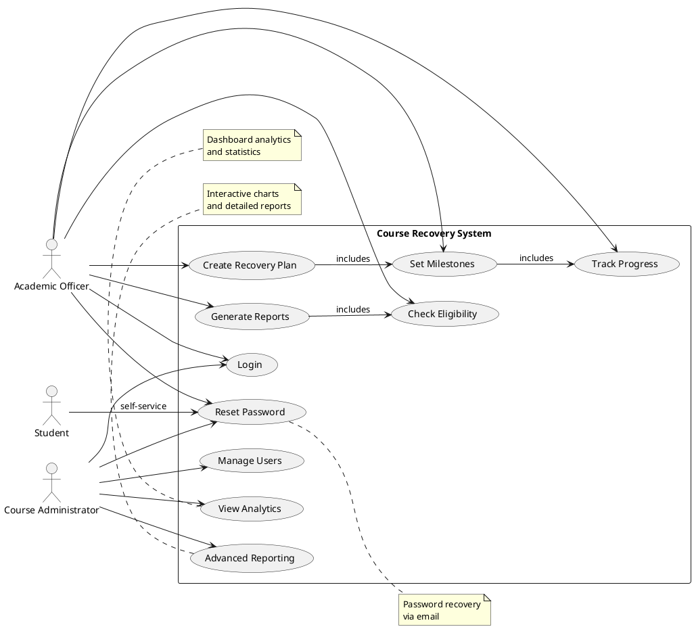
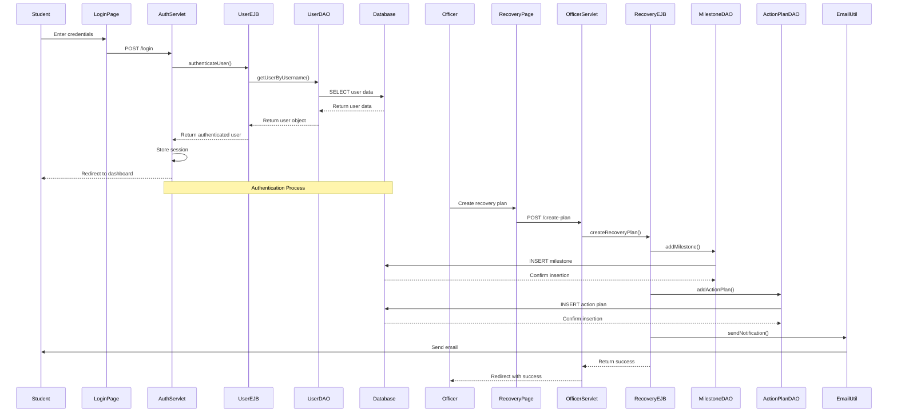

# Course Recovery System Design Document

## Cover Page

Course Recovery System Design Document

Prepared by: EPDA Assignment Group

Date: January 23, 2026

## Table of Contents

1. Introduction
2. System Architecture Overview
3. Web Components Design
4. Business Tier Design
5. Database Design
6. System Navigation
7. UML Diagrams
8. Additional Features
9. Screen Captures
10. References

## Introduction

The Course Recovery System is a web-based application designed to help educational institutions manage student course recovery processes. The system allows course administrators and academic officers to create recovery plans, set milestones, track progress, and monitor student eligibility for course progression. Students can view their recovery plans and track their progress toward academic recovery goals. The application follows a three-tier architecture with presentation, business, and database tiers implemented using Java Enterprise Edition technologies.

## System Architecture Overview

The Course Recovery System implements a three-tier architecture consisting of presentation, business, and database tiers. The presentation tier uses JavaServer Pages for rendering web interfaces and servlets for handling HTTP requests and responses \cite{apache-tomcat-docs}. The business tier employs Enterprise JavaBeans for implementing business logic, transaction management, and data processing \cite{oracle-javaee-tutorial}. The database tier uses MySQL for persistent data storage with JDBC for data access operations \cite{mysql-refman}.

The presentation tier communicates with the business tier through EJB method invocations, while the business tier accesses the database tier through DAO classes that encapsulate SQL operations. This layered architecture ensures separation of concerns, maintainability, and scalability of the system. Security is implemented through custom filters that enforce role-based access control and protect against common web vulnerabilities such as cross-site request forgery \cite{owasp-cheatsheet}.

## Web Components Design

The web components of the Course Recovery System are implemented using JavaServer Pages and servlets running on Apache Tomcat. The presentation tier consists of multiple JSP pages for different user roles and functionalities. Admin users have access to user management, system analytics, and advanced reporting pages. Academic officers can manage recovery plans, check student eligibility, and generate academic reports. All users can access login, password reset, and profile management features.

Servlets handle HTTP requests and coordinate with the business tier through EJB method calls. The AdminServlet manages administrative functions such as user CRUD operations and system analytics. The OfficerServlet handles academic officer responsibilities including recovery plan management and eligibility checking. The AuthServlet manages authentication and authorization processes. Custom security filters intercept all requests to enforce access control and implement security headers.

JSP pages use JSTL tags for conditional rendering and data iteration. Forms include client-side validation using HTML5 attributes and JavaScript for enhanced user experience. The system implements responsive design principles to ensure compatibility across different devices and screen sizes.

## Business Tier Design

The business tier is implemented using stateless Enterprise JavaBeans that provide transaction management and business logic encapsulation. The RecoveryEJB handles all recovery plan related operations including creating milestones, action plans, and progress tracking. The AcademicEJB manages academic operations such as eligibility checking, CGPA calculation, and grade management. The UserEJB handles user authentication, authorization, and account management functions.

The AnalyticsEJB provides statistical analysis and reporting capabilities for system administrators. Each EJB uses container-managed transactions to ensure data consistency and integrity. Business logic is separated from presentation concerns, allowing for independent testing and maintenance of each layer.

The EJBs interact with data access objects that encapsulate database operations. This design ensures that business rules are consistently applied across all system operations and provides a clear separation between business logic and data persistence concerns.

## Database Design

The database tier uses MySQL to store all system data with a normalized relational schema. The Users table stores system users with roles for access control. The Students table contains student information including academic performance data. The Courses table maintains course catalog information. The Grades table tracks student performance across different course attempts. The RecoveryPlans table stores legacy recovery plan data.

Enhanced tables include Milestones for high-level recovery goals and ActionPlans for detailed recovery tasks. The PasswordResetTokens table securely manages password reset operations. Indexes are created on frequently queried columns to optimize performance. Foreign key constraints ensure referential integrity across related tables.

Data access is performed through DAO classes that use JDBC prepared statements to prevent SQL injection attacks. Connection pooling is implemented for efficient resource management. The database design supports the three-attempt course retrieval policy through attempt tracking in the grades table.

## System Navigation

The application provides role-based navigation with different interfaces for administrators, academic officers, and students. Administrators access the system through a dashboard showing system analytics and user management tools. Academic officers navigate to recovery plan management, eligibility checking, and academic reporting features. All users start at the login page and can access password reset functionality.

Navigation is implemented through server-side redirects and JSP includes for consistent header and footer content. Session management tracks user authentication state and role information. The system prevents unauthorized access through security filters that validate user permissions on each request.

## UML Diagrams

### Class Diagram

```mermaid
classDiagram
    class User {
        -int id
        -String username
        -String password
        -String role
        -String email
        -String status
        +authenticate()
        +updatePassword()
    }

    class Student {
        -int id
        -String name
        -String program
        -String email
        -double currentCgpa
        +calculateCGPA()
        +checkEligibility()
    }

    class Course {
        -String code
        -String title
        -int creditHours
        +getCode()
        +getTitle()
        +getCreditHours()
    }

    class Grade {
        -int studentId
        -String courseCode
        -String semester
        -int year
        -int attemptNo
        -String grade
        -double gradePoint
        -String status
        +getLatestGrade()
    }

    class Milestone {
        -int id
        -int studentId
        -String courseCode
        -String title
        -String description
        -Date targetDate
        -String status
        +create()
        +updateStatus()
    }

    class ActionPlan {
        -int id
        -Integer milestoneId
        -int studentId
        -String courseCode
        -String task
        -Timestamp deadline
        -String status
        -String grade
        -Double gradePoint
        -String progressNotes
        +updateProgress()
    }

    User ||--o{ Student : manages
    Student ||--o{ Course : enrolls
    Student ||--o{ Grade : receives
    Student ||--o{ Milestone : has
    Milestone ||--o{ ActionPlan : contains
    Course ||--o{ Grade : has
    Course ||--o{ Milestone : relates
    Course ||--o{ ActionPlan : relates
```

### Use Case Diagram



### Sequence Diagram - Course Recovery Process



### Entity Relationship Diagram

```mermaid
erDiagram
    Users {
        int id PK
        varchar username UQ
        varchar password
        varchar role
        varchar email UQ
        varchar status
        timestamp created_at
    }

    Students {
        int id PK
        varchar name
        varchar program
        varchar email UQ
        decimal current_cgpa
        timestamp created_at
    }

    Courses {
        varchar code PK
        varchar title
        int credit_hours
    }

    Grades {
        int student_id FK
        varchar course_code FK
        varchar semester
        int year
        int attempt_no
        varchar grade
        decimal grade_point
        varchar status
    }

    Milestones {
        int id PK
        int student_id FK
        varchar course_code FK
        varchar title
        text description
        date target_date
        varchar status
        timestamp created_at
    }

    ActionPlans {
        int id PK
        int milestone_id FK
        int student_id FK
        varchar course_code FK
        text task
        timestamp deadline
        varchar status
        varchar grade
        decimal grade_point
        text progress_notes
        timestamp created_at
        timestamp updated_at
    }

    RecoveryPlans {
        int id PK
        int student_id FK
        varchar course_code FK
        text task
        timestamp deadline
        varchar status
        timestamp created_at
    }

    PasswordResetTokens {
        int id PK
        int user_id FK
        varchar token UQ
        timestamp expires_at
        boolean used
        timestamp created_at
    }

    Users ||--o{ Students : manages
    Users ||--o{ PasswordResetTokens : has
    Students ||--o{ Grades : receives
    Students ||--o{ Milestones : creates
    Students ||--o{ ActionPlans : participates
    Students ||--o{ RecoveryPlans : has
    Courses ||--o{ Grades : awarded
    Courses ||--o{ Milestones : relates
    Courses ||--o{ ActionPlans : relates
    Courses ||--o{ RecoveryPlans : relates
    Milestones ||--o{ ActionPlans : contains
```

## Additional Features

The system includes two additional features beyond the core requirements to enhance functionality and provide advanced capabilities. The first additional feature is a dashboard analytics system that provides real-time statistical insights for administrators. This feature displays key metrics including total student count, eligibility statistics, recovery plan success rates, and system usage patterns. The analytics are presented through visual metric cards on the admin dashboard, allowing administrators to quickly assess system performance and student progress without manual data analysis.

The second additional feature is an advanced reporting system with interactive charts and comprehensive data visualization. This feature provides detailed analytics through Chart.js implementations including CGPA distribution pie charts, grade distribution bar charts, and failed courses trend line charts \cite{chartjs-docs}. The advanced reporting page includes export capabilities for PDF generation and CSV data export, along with recent activity tracking and detailed statistical breakdowns. These additional features enhance the system's analytical capabilities and provide administrators with powerful tools for data-driven decision making and performance monitoring.

## Screen Captures

Figure 1 shows the system login page where users enter their credentials to access the Course Recovery System. The page includes fields for username and password entry, a remember me option, and a forgot password link. The interface uses a clean, professional design with the system logo and responsive layout that adapts to different screen sizes.

Figure 2 displays the admin dashboard after successful login. The dashboard presents key system metrics in visual cards including total student count, eligibility statistics, active recovery plans, and success rates. Navigation links provide access to user management, recovery planning, eligibility checking, and advanced reporting features. The dashboard serves as the central hub for administrative functions.

Figure 3 illustrates the user management interface accessible to administrators. The page shows a table listing all system users with their details including ID, username, role, email, and status. Action buttons allow administrators to edit user information or deactivate accounts. A prominent "Add User" button provides access to the user creation form.

Figure 4 depicts the add user form used for creating new system accounts. The form includes fields for username, password, role selection (admin or officer), and email address. Client-side validation ensures data integrity before submission, and server-side validation provides additional security and format checking.

Figure 5 shows the advanced reports page featuring interactive data visualizations. The page includes a CGPA distribution pie chart showing student performance ranges, a grade distribution bar chart displaying grade frequencies, and a failed courses trend line chart illustrating performance patterns over time. Export buttons allow administrators to generate PDF reports or CSV data files.

Figure 6 displays the recovery plan management interface for academic officers. The page shows current recovery plans with student information, course details, assigned tasks, deadlines, and completion status. Officers can create new recovery plans, update existing ones, and monitor student progress through this centralized interface.

Figure 7 illustrates the eligibility checking page where academic officers can verify student progression requirements. The page displays student lists with CGPA calculations and failed course counts. Students meeting the criteria of minimum 2.0 CGPA and no more than three failed courses are marked as eligible for progression.

Figure 8 shows the academic performance report generation interface. Officers can select students and generate detailed reports showing course grades, grade points, cumulative GPA calculations, and semester-by-semester performance breakdowns. The reports help track student academic progress and identify areas requiring intervention.

## References

\bibliography{references}
