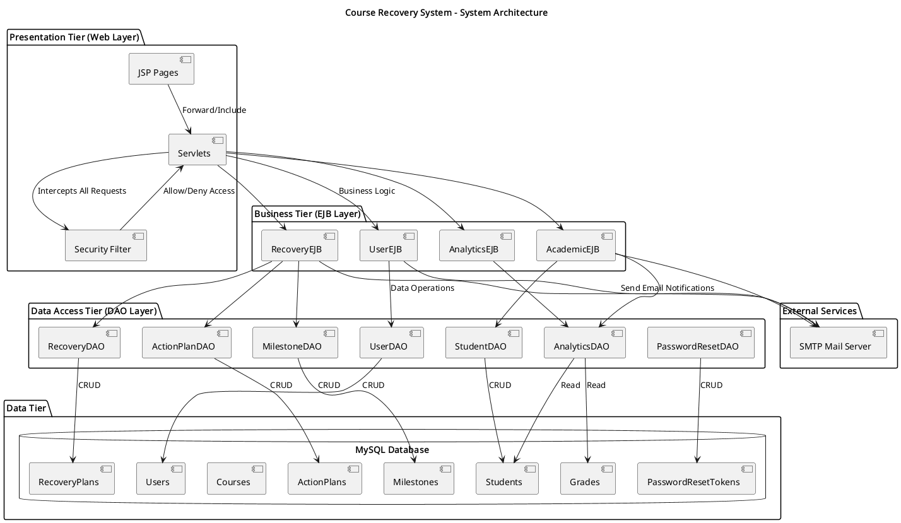
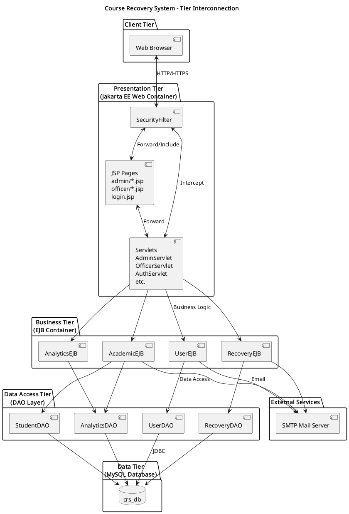
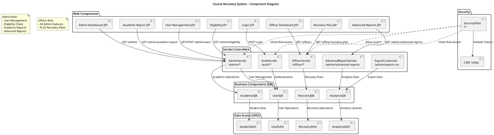
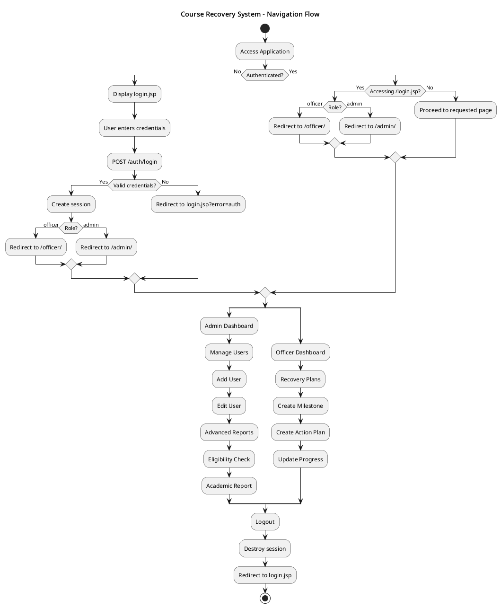
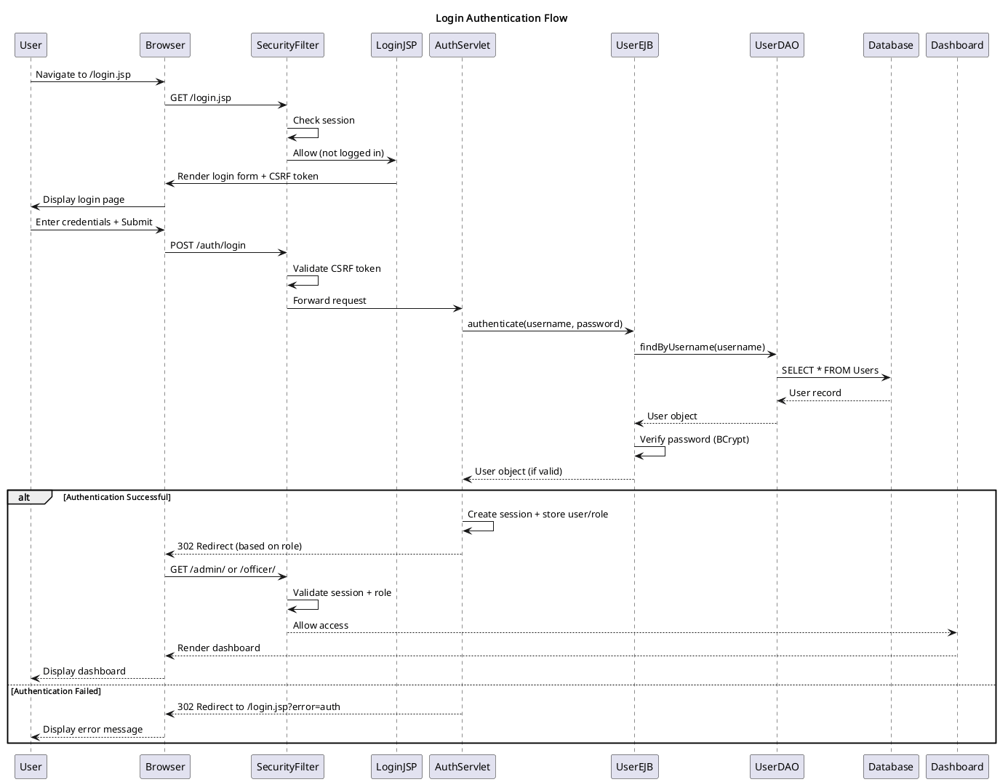
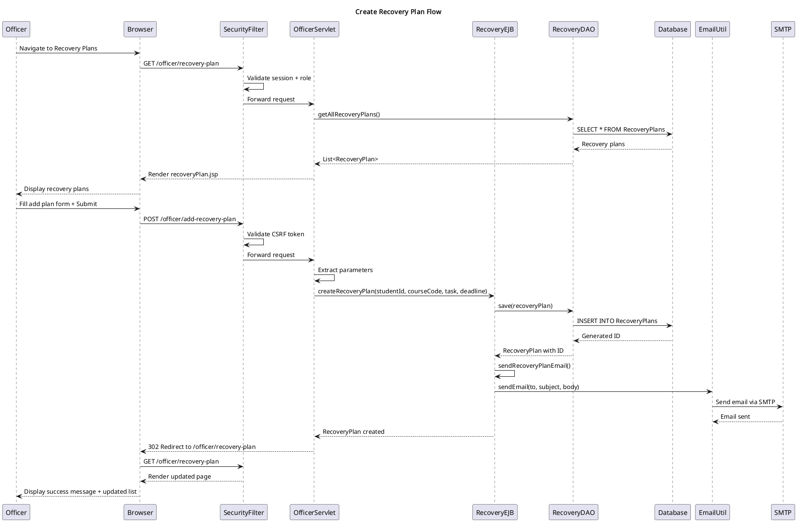
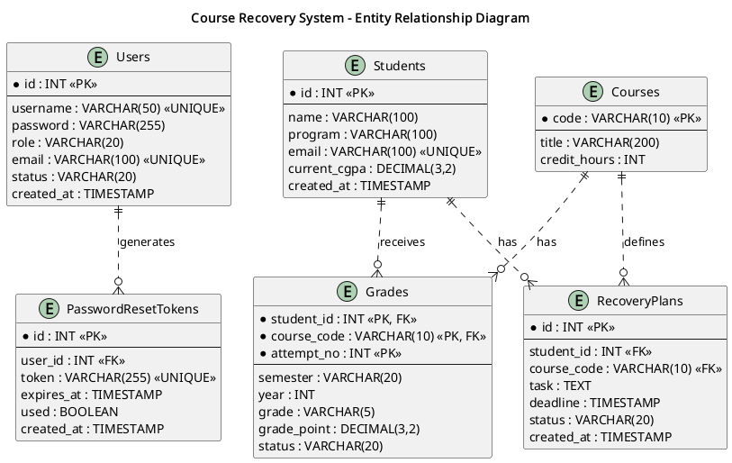

# Course Recovery System - Technical Documentation

## Overview of Application

### Brief Description of System Architecture

The Course Recovery System is a web-based application built using **Jakarta EE** technologies for managing student academic performance and course recovery programs. The system follows a **multi-tier architecture** pattern with clear separation of concerns across presentation, business, data access, and data tiers.

#### Key Architectural Features

- **Presentation Tier**: JSP pages for views, Servlets for controllers, and Filters for cross-cutting concerns
- **Business Tier**: Enterprise JavaBeans (EJB) for business logic and email notifications
- **Data Access Tier**: Data Access Objects (DAO) for database operations
- **Data Tier**: MySQL relational database
- **Security**: Role-based access control with CSRF protection

### System Architecture Diagram



*Figure 1: System Architecture - Shows the four-tier architecture with external services*

### Tier Interconnection



*Figure 2: Tier Interconnection - Details the flow of requests through each tier*

The application flows through these tiers as follows:

1. **Client Request** → Security Filter intercepts all requests
2. **Security Filter** → Validates authentication and authorization
3. **Servlet** → Processes request, invokes business logic
4. **EJB** → Executes business rules, sends notifications
5. **DAO** → Performs CRUD operations on database
6. **Database** → Persists and retrieves data
7. **Response** → JSP renders view, returns to client

---

## Design of Web Components

### Web Component Technologies

The application utilizes **Jakarta Servlet** and **JavaServer Pages (JSP)** technologies for web component implementation.

#### Servlets

Servlets serve as the **controller** components in the MVC pattern, handling HTTP requests and coordinating between the view and business layers.

| Servlet | URL Pattern | Purpose |
|---------|-------------|---------|
| `AuthServlet` | `/auth/*` | User authentication, login, logout, password reset |
| `AdminServlet` | `/admin/*` | User management, eligibility checks, academic reports |
| `OfficerServlet` | `/officer/*` | Recovery plan management |
| `AdvancedReportServlet` | `/admin/advanced-reports` | Analytics dashboard |
| `ExportCsvServlet` | `/admin/export-csv` | CSV data export |

**Servlet Implementation Pattern:**
```java
@WebServlet("/admin/*")
public class AdminServlet extends HttpServlet {
    private UserEJB userEJB = new UserEJB();
    
    @Override
    protected void doGet(HttpServletRequest request, HttpServletResponse response) 
            throws ServletException, IOException {
        // Session validation
        HttpSession session = request.getSession(false);
        if (session == null || session.getAttribute("role") == null) {
            response.sendRedirect("/login.jsp");
            return;
        }
        
        // Request routing based on path
        String path = request.getPathInfo();
        switch (path) {
            case "/users": handleListUsers(request, response); break;
            case "/eligibility": handleEligibility(request, response); break;
            // ... more cases
        }
    }
}
```

#### JavaServer Pages (JSP)

JSP pages serve as the **view** layer, using JSTL tags for dynamic content rendering. All JSPs are stored under `/WEB-INF/` for direct access prevention.

**JSP Organization:**

```
/WEB-INF/
├── admin/           # Admin role pages
│   ├── index.jsp           # Dashboard
│   ├── manageUsers.jsp     # User listing
│   ├── addUser.jsp         # Add user form
│   ├── editUser.jsp        # Edit user form
│   ├── advancedReports.jsp # Analytics dashboard
│   ├── eligibility.jsp     # Eligibility checker
│   └── academicReport.jsp  # Academic performance report
├── officer/         # Officer role pages
│   ├── index.jsp           # Dashboard
│   └── recoveryPlan.jsp    # Recovery plan management
├── includes/        # Reusable components
│   ├── header.jsp          # Navigation header
│   └── footer.jsp          # Site footer
└── lib/             # JAR libraries
```

**JSP Include Pattern:**
```jsp
<%@ page contentType="text/html;charset=UTF-8" language="java" %>
<%@ taglib uri="http://java.sun.com/jsp/jstl/core" prefix="c" %>
<% request.setAttribute("currentPage", "dashboard"); %>
<jsp:include page="/WEB-INF/includes/header.jsp" />

<!-- Page content -->
<div class="container">
    <h2>${pageTitle}</h2>
    <c:forEach var="item" items="${items}">
        <p>${item.name}</p>
    </c:forEach>
</div>

<jsp:include page="/WEB-INF/includes/footer.jsp" />
```

#### Filters

The `SecurityFilter` implements cross-cutting concerns for security:

- **Authentication**: Validates user session
- **Authorization**: Role-based access control
- **CSRF Protection**: Token validation for POST requests
- **Session Management**: Redirects logged-in users appropriately

**Filter Configuration:**
```java
@WebFilter("/*")
public class SecurityFilter implements Filter {
    @Override
    public void doFilter(ServletRequest request, ServletResponse response, 
                         FilterChain chain) throws IOException, ServletException {
        String path = httpRequest.getRequestURI().substring(contextPath.length());
        
        // Allow static resources
        if (path.startsWith("/css/") || path.startsWith("/auth/")) {
            chain.doFilter(request, response);
            return;
        }
        
        // Redirect logged-in users from login.jsp
        if (path.equals("/login.jsp") && session.getAttribute("user") != null) {
            httpResponse.sendRedirect(getDashboardForRole(role));
            return;
        }
        
        // Validate authentication and authorization
        // ...
    }
}
```

### Component Diagram



*Figure 3: Component Diagram - Shows web components, servlets, EJBs, and DAOs*

---

## Web Page Design

### General Navigation Chart

The application implements role-based navigation with two distinct user roles:

- **Admin**: Limited access to user management and reports
- **Officer**: Full access to all features including recovery plans



*Figure 4: Navigation Flow - Shows page navigation for both admin and officer roles*

### Page Descriptions

#### Public Pages (No Authentication Required)

| Page | Path | Description |
|------|------|-------------|
| Login | `/login.jsp` | User authentication with CSRF protection |
| Forgot Password | `/forgotPassword.jsp` | Password reset request form |
| Reset Password | `/resetPassword.jsp` | Password reset with token validation |
| Error | `/error.jsp` | Generic error display page |

#### Admin Pages (Admin Role)

| Page | Path | Description |
|------|------|-------------|
| Dashboard | `/admin/` | System overview with quick statistics |
| Manage Users | `/admin/users` | User listing with edit/delete actions |
| Add User | `/admin/add-user` | New user creation form |
| Edit User | `/admin/edit-user` | User modification form |
| Advanced Reports | `/admin/advanced-reports` | Analytics dashboard with charts |
| Eligibility Check | `/admin/eligibility` | Student eligibility for recovery program |
| Academic Report | `/admin/academic-report` | Individual student academic performance |

#### Officer Pages (Officer Role)

| Page | Path | Description |
|------|------|-------------|
| Dashboard | `/officer/` | Student list with recovery plan status |
| Recovery Plans | `/officer/recovery-plan` | Create and manage recovery plans, milestones, action plans |

### Authentication Flow



*Figure 5: Login Authentication Flow - Sequence diagram showing the login process*

---

## Design of Business Tier

### Business Tier Technologies

The business tier is implemented using **Enterprise JavaBeans (EJB)**, providing:

- **Transaction Management**: Automatic transaction demarcation
- **Business Logic Encapsulation**: Clean separation from presentation layer
- **Email Notifications**: Integrated email service for user communications
- **Dependency Injection**: Loose coupling between components

### EJB Components

#### UserEJB - User Management

**Responsibilities:**
- User authentication with BCrypt password verification
- User CRUD operations
- Password reset token management
- Email notifications for account events

**Key Methods:**
```java
public class UserEJB {
    public User authenticate(String username, String password) throws SQLException;
    public User createUser(String username, String password, String role, String email) throws SQLException;
    public boolean requestPasswordReset(String email) throws SQLException;
    public boolean resetPasswordWithToken(String token, String newPassword) throws SQLException;
    private void sendWelcomeEmail(String email, String username);
    private void sendDeactivationEmail(String email, String username);
}
```

#### AcademicEJB - Academic Operations

**Responsibilities:**
- Student academic performance calculation
- Grade management and CGPA computation
- Eligibility determination for recovery program
- Academic report generation and email delivery

**Key Methods:**
```java
public class AcademicEJB {
    public double calculateCGPA(int studentId) throws SQLException;
    public boolean isEligibleForRecovery(int studentId) throws SQLException;
    public List<Grade> getStudentGrades(int studentId) throws SQLException;
    public void sendAcademicReport(int studentId) throws SQLException;
    public boolean canAttemptCourse(int studentId, String courseCode) throws SQLException;
}
```

#### RecoveryEJB - Recovery Plan Management

**Responsibilities:**
- Recovery plan creation and management
- Milestone tracking
- Action plan coordination
- Progress monitoring and notifications

**Key Methods:**
```java
public class RecoveryEJB {
    public RecoveryPlan createRecoveryPlan(int studentId, String courseCode, 
                                           String task, LocalDateTime deadline) throws SQLException;
    public Milestone createMilestone(int studentId, String courseCode, 
                                     String title, LocalDate targetDate) throws SQLException;
    public ActionPlan createActionPlan(int milestoneId, String task, 
                                       LocalDateTime deadline) throws SQLException;
    public void updateMilestoneStatus(int milestoneId, String status) throws SQLException;
    private void sendRecoveryPlanEmail(RecoveryPlan plan) throws SQLException;
    private void sendMilestoneEmail(Milestone milestone) throws SQLException;
}
```

#### AnalyticsEJB - Analytics and Reporting

**Responsibilities:**
- System-wide analytics aggregation
- CGPA distribution calculation
- Grade distribution analysis
- Failed courses tracking by semester
- CSV export data preparation

**Key Methods:**
```java
public class AnalyticsEJB {
    public Map<String, Object> getSystemAnalytics() throws SQLException;
    public Map<String, Object> getAcademicAnalytics() throws SQLException;
    public Map<String, Integer> getCgpaDistribution() throws SQLException;
    public Map<String, Integer> getGradeDistribution() throws SQLException;
    public Map<String, Integer> getFailedCoursesBySemester() throws SQLException;
}
```

### Email Notification System

The application sends automated email notifications for:

1. **User Account Management**
   - Welcome emails for new accounts
   - Account deactivation notices

2. **Password & Recovery Management**
   - Password reset requests with secure tokens
   - Password reset confirmations

3. **Course Recovery**
   - Recovery plan creation notifications
   - Milestone assignments
   - Action plan assignments
   - Progress updates

4. **Academic Performance Reports**
   - Semester grade reports
   - CGPA summaries

**Email Configuration:**
```properties
MAIL_SMTP_HOST=smtp.example.com
MAIL_SMTP_PORT=587
MAIL_SMTP_USERNAME=user@example.com
MAIL_SMTP_PASSWORD=secret
MAIL_SMTP_AUTH=true
MAIL_SMTP_STARTTLS_ENABLE=true
```

### Recovery Plan Creation Flow



*Figure 7: Recovery Plan Creation Flow - Sequence diagram showing the process of creating a recovery plan*

---

## Database Design

### Database Schema

The application uses **MySQL** as the relational database management system. The database `crs_db` contains the following tables:

### Tables Description

#### Users

Stores system user accounts (admins and officers).

| Column | Type | Constraints | Description |
|--------|------|-------------|-------------|
| id | INT | PRIMARY KEY, AUTO_INCREMENT | Unique user identifier |
| username | VARCHAR(50) | UNIQUE, NOT NULL | Login username |
| password | VARCHAR(255) | NOT NULL | BCrypt hashed password |
| role | VARCHAR(20) | NOT NULL | User role: 'admin' or 'officer' |
| email | VARCHAR(100) | UNIQUE, NOT NULL | User email address |
| status | VARCHAR(20) | DEFAULT 'active' | Account status |
| created_at | TIMESTAMP | DEFAULT CURRENT_TIMESTAMP | Account creation date |

#### Students

Stores student information.

| Column | Type | Constraints | Description |
|--------|------|-------------|-------------|
| id | INT | PRIMARY KEY, AUTO_INCREMENT | Unique student identifier |
| name | VARCHAR(100) | NOT NULL | Student full name |
| program | VARCHAR(100) | NOT NULL | Academic program |
| email | VARCHAR(100) | UNIQUE, NOT NULL | Student email address |
| current_cgpa | DECIMAL(3,2) | DEFAULT 0.00 | Current cumulative GPA |
| created_at | TIMESTAMP | DEFAULT CURRENT_TIMESTAMP | Record creation date |

#### Courses

Stores course catalog information.

| Column | Type | Constraints | Description |
|--------|------|-------------|-------------|
| code | VARCHAR(10) | PRIMARY KEY | Course code (e.g., CS101) |
| title | VARCHAR(200) | NOT NULL | Course title |
| credit_hours | INT | NOT NULL | Course credit hours |

#### Grades

Stores student grade records with composite primary key.

| Column | Type | Constraints | Description |
|--------|------|-------------|-------------|
| student_id | INT | PRIMARY KEY, FOREIGN KEY | Reference to Students |
| course_code | VARCHAR(10) | PRIMARY KEY, FOREIGN KEY | Reference to Courses |
| attempt_no | INT | PRIMARY KEY, DEFAULT 1 | Attempt number (max 3) |
| semester | VARCHAR(20) | NOT NULL | Academic semester |
| year | INT | NOT NULL | Academic year |
| grade | VARCHAR(5) | NOT NULL | Letter grade (A, B+, C-, etc.) |
| grade_point | DECIMAL(3,2) | NOT NULL | Grade point value |
| status | VARCHAR(20) | NOT NULL | Pass/Fail status |

#### Milestones

Stores recovery plan milestones for students.

| Column | Type | Constraints | Description |
|--------|------|-------------|-------------|
| id | INT | PRIMARY KEY, AUTO_INCREMENT | Unique milestone identifier |
| student_id | INT | FOREIGN KEY | Reference to Students |
| course_code | VARCHAR(10) | FOREIGN KEY | Reference to Courses |
| title | VARCHAR(200) | NOT NULL | Milestone title |
| description | TEXT | - | Milestone description |
| target_date | DATE | NOT NULL | Target completion date |
| status | VARCHAR(20) | DEFAULT 'active' | Milestone status |
| created_at | TIMESTAMP | DEFAULT CURRENT_TIMESTAMP | Creation date |

#### ActionPlans

Stores action plans linked to milestones.

| Column | Type | Constraints | Description |
|--------|------|-------------|-------------|
| id | INT | PRIMARY KEY, AUTO_INCREMENT | Unique action plan identifier |
| milestone_id | INT | FOREIGN KEY | Reference to Milestones |
| student_id | INT | FOREIGN KEY | Reference to Students |
| course_code | VARCHAR(10) | FOREIGN KEY | Reference to Courses |
| task | TEXT | NOT NULL | Task description |
| deadline | TIMESTAMP | NOT NULL | Task deadline |
| status | VARCHAR(20) | DEFAULT 'pending' | Task status |
| grade | VARCHAR(5) | - | Grade achieved (if applicable) |
| grade_point | DECIMAL(3,2) | - | Grade point achieved |
| progress_notes | TEXT | - | Progress notes |
| created_at | TIMESTAMP | DEFAULT CURRENT_TIMESTAMP | Creation date |
| updated_at | TIMESTAMP | ON UPDATE CURRENT_TIMESTAMP | Last update date |

#### RecoveryPlans (Legacy)

Legacy table for backward compatibility.

| Column | Type | Constraints | Description |
|--------|------|-------------|-------------|
| id | INT | PRIMARY KEY, AUTO_INCREMENT | Unique recovery plan identifier |
| student_id | INT | FOREIGN KEY | Reference to Students |
| course_code | VARCHAR(10) | FOREIGN KEY | Reference to Courses |
| task | TEXT | NOT NULL | Recovery task |
| deadline | TIMESTAMP | NOT NULL | Task deadline |
| status | VARCHAR(20) | DEFAULT 'active' | Plan status |
| created_at | TIMESTAMP | DEFAULT CURRENT_TIMESTAMP | Creation date |

#### PasswordResetTokens

Stores password reset tokens for secure password recovery.

| Column | Type | Constraints | Description |
|--------|------|-------------|-------------|
| id | INT | PRIMARY KEY, AUTO_INCREMENT | Unique token identifier |
| user_id | INT | FOREIGN KEY | Reference to Users |
| token | VARCHAR(255) | UNIQUE, NOT NULL | Secure random token |
| expires_at | TIMESTAMP | NOT NULL | Token expiration date |
| used | BOOLEAN | DEFAULT FALSE | Token usage flag |
| created_at | TIMESTAMP | DEFAULT CURRENT_TIMESTAMP | Token creation date |

### Entity Relationship Diagram



*Figure 6: Entity Relationship Diagram - Shows database tables and their relationships*

### Database Indexes

Performance optimization indexes:

```sql
-- User indexes
CREATE INDEX idx_users_username ON Users(username);
CREATE INDEX idx_users_role ON Users(role);

-- Student indexes
CREATE INDEX idx_students_name ON Students(name);
CREATE INDEX idx_students_program ON Students(program);

-- Grade indexes
CREATE INDEX idx_grades_student ON Grades(student_id);
CREATE INDEX idx_grades_status ON Grades(status);

-- Recovery system indexes
CREATE INDEX idx_milestones_student ON Milestones(student_id);
CREATE INDEX idx_milestones_course ON Milestones(course_code);
CREATE INDEX idx_milestones_status ON Milestones(status);
CREATE INDEX idx_action_plans_milestone ON ActionPlans(milestone_id);
CREATE INDEX idx_action_plans_student ON ActionPlans(student_id);
CREATE INDEX idx_action_plans_course ON ActionPlans(course_code);
CREATE INDEX idx_action_plans_status ON ActionPlans(status);

-- Password reset indexes
CREATE INDEX idx_password_reset_token ON PasswordResetTokens(token);
CREATE INDEX idx_password_reset_user ON PasswordResetTokens(user_id);
CREATE INDEX idx_password_reset_expires ON PasswordResetTokens(expires_at);
```

### Database Access APIs (DAO Layer)

The Data Access Object (DAO) pattern provides a clean abstraction for database operations.

#### DAO Classes

| DAO Class | Entity | Key Operations |
|-----------|--------|----------------|
| `UserDAO` | Users | `create()`, `findByUsername()`, `update()`, `delete()`, `getAll()` |
| `StudentDAO` | Students | `getAll()`, `getById()`, `calculateCGPA()`, `getFailedCourseCount()` |
| `RecoveryDAO` | RecoveryPlans | `save()`, `getByStudentId()`, `updateStatus()`, `delete()` |
| `MilestoneDAO` | Milestones | `save()`, `getByStudentId()`, `updateStatus()` |
| `ActionPlanDAO` | ActionPlans | `save()`, `getByMilestoneId()`, `updateStatus()` |
| `AnalyticsDAO` | Multiple | `getSystemAnalytics()`, `getCgpaDistribution()`, `getGradeDistribution()` |
| `PasswordResetDAO` | PasswordResetTokens | `saveToken()`, `findToken()`, `markAsUsed()` |

#### DAO Implementation Pattern

```java
public class UserDAO {
    private static final String FIND_BY_USERNAME = 
        "SELECT * FROM Users WHERE username = ?";
    
    public static User findByUsername(String username) throws SQLException {
        try (Connection conn = DBConnect.getConnection();
             PreparedStatement ps = conn.prepareStatement(FIND_BY_USERNAME)) {
            
            ps.setString(1, username);
            try (ResultSet rs = ps.executeQuery()) {
                if (rs.next()) {
                    return mapResultSetToUser(rs);
                }
            }
        }
        return null;
    }
    
    private static User mapResultSetToUser(ResultSet rs) throws SQLException {
        return new User(
            rs.getInt("id"),
            rs.getString("username"),
            rs.getString("password"),
            rs.getString("role"),
            rs.getString("email"),
            rs.getString("status")
        );
    }
}
```

#### Database Connection Management

```java
public class DBConnect {
    private static DataSource dataSource;
    
    static {
        // Initialize connection pool
        BasicDataSource ds = new BasicDataSource();
        ds.setDriverClassName("com.mysql.cj.jdbc.Driver");
        ds.setUrl(System.getenv("DB_URL"));
        ds.setUsername(System.getenv("DB_USERNAME"));
        ds.setPassword(System.getenv("DB_PASSWORD"));
        ds.setInitialSize(5);
        ds.setMaxTotal(20);
        dataSource = ds;
    }
    
    public static Connection getConnection() throws SQLException {
        return dataSource.getConnection();
    }
}
```

---

## Appendix

### Technology Stack

| Layer | Technology |
|-------|------------|
| **Web Server** | Apache TomEE 10.1.52 |
| **Web Framework** | Jakarta Servlet 6.0, JSP 3.1 |
| **Business Components** | Enterprise JavaBeans (EJB) |
| **Database** | MySQL 8.0 |
| **Connection Pool** | Apache Commons DBCP 2.11.0 |
| **Security** | BCrypt password hashing, CSRF tokens |
| **Email** | Jakarta Mail 2.1.0 |
| **Utilities** | Jackson 2.15.2 (JSON), Commons BeanUtils |

### Role-Based Access Control Matrix

| Feature | Admin | Officer | Unauthenticated |
|---------|-------|---------|-----------------|
| Login | ✓ | ✓ | - |
| User Management | ✓ | ✓ | ✗ |
| Eligibility Check | ✓ | ✓ | ✗ |
| Academic Reports | ✓ | ✓ | ✗ |
| Advanced Reports | ✓ | ✓ | ✗ |
| Recovery Plans | ✗ | ✓ | ✗ |
| Password Reset | ✓ | ✓ | ✓ |

### Environment Variables

```bash
# Database Configuration
DB_URL=jdbc:mysql://localhost:3306/crs_db
DB_USERNAME=root
DB_PASSWORD=secret

# Email Configuration
MAIL_SMTP_HOST=smtp.example.com
MAIL_SMTP_PORT=587
MAIL_SMTP_USERNAME=user@example.com
MAIL_SMTP_PASSWORD=secret
MAIL_SMTP_AUTH=true
MAIL_SMTP_STARTTLS_ENABLE=true
```

---

*Documentation generated for Course Recovery System v1.0*
